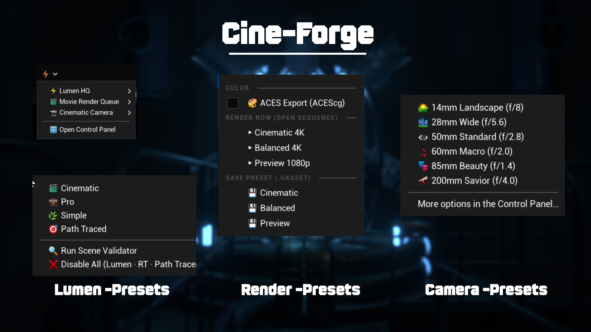
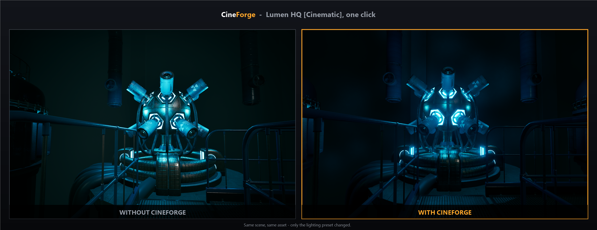
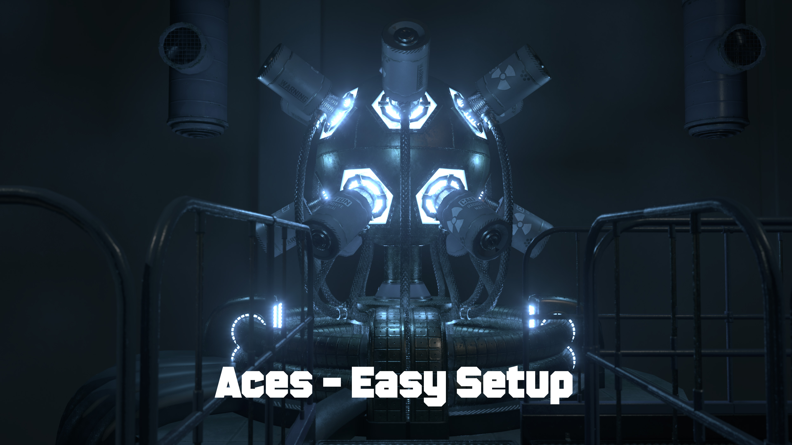

# CineForge

**One-stop cinematic toolkit for Unreal Engine filmmakers and artists.**

CineForge puts everything a UE filmmaker needs behind a single toolbar button and
a dockable control panel: one-click Lumen quality setups, a crash-proofed Path
Tracer mode, Movie Render Queue presets with Render Now, ACES color export, and
real cinematic camera spawning.



- **Engine support:** Unreal Engine **5.4 → 5.8** — every version compile-verified, prebuilt binaries included for all five
- **Platform:** Windows editor (DirectX 12)
- **License:** Commercial — sold on Fab under the Epic Fab EULA

### ⬇ Get CineForge

CineForge is available on **[Fab](https://www.fab.com)** — one purchase covers
prebuilt binaries for UE 5.4, 5.5, 5.6, 5.7 and 5.8. Install straight to your
engine from the Epic Games Launcher — no compiler needed. See
[INSTALLATION.md](INSTALLATION.md) for the 60-second quick start.

### 🎬 See the difference

One click applies a curated **Lumen HQ [Cinematic]** setup — better global
illumination, richer contrast, cleaner shadows. Same scene, same asset, only the
preset changed:



---

## Installation

**Per project (recommended):**
1. Copy the `CineForge` folder into your project's `Plugins/` directory
   (create it if it doesn't exist).
2. Open the project. If prompted to rebuild the plugin, accept (requires a C++
   toolchain — Visual Studio 2022 with the *Game development with C++* workload).
3. Find **CineForge** on the Level Editor toolbar, or open **Window → CineForge**.

**Engine-wide (all projects):** copy `CineForge` into
`<Engine>/Engine/Plugins/Marketplace/CineForge` and build once from any C++
project, or use a prebuilt release matching your engine version.

> Blueprint-only projects: use a release zip with prebuilt `Binaries/` for your
> exact engine version, or add a single C++ class to make the project compile
> plugins.

---

## ⚡ Lumen HQ

One-click global illumination setups, applied to project settings, a
PostProcessVolume, and (persistently) your project config:

| Preset | Pipeline | For |
|---|---|---|
| 🎬 **Cinematic** | Lumen + Hit Lighting + MegaLights*, VSM, Nanite, max gather quality | Final-quality look dev & renders |
| 💼 **Pro** | Hardware RT + Surface Cache | Fast, great-looking viewport |
| 🌿 **Simple** | Software Lumen | Any GPU, no RT required |
| 🎯 **Path Traced** | Reference path tracer | Ground-truth hero shots & stills |
| ❌ **Disable All** | Engine defaults | Clean revert of everything |

\* MegaLights on UE 5.5+.

**Built-in intelligence:**
- **Scene Validator** — flags static lights, non-Nanite meshes, missing
  PostProcessVolume, and reports your *actual* ray-tracing state (not a guess).
- **Guided RT setup** — if hardware ray tracing isn't active, applying an RT
  preset configures DX12 + SM6 + Ray Tracing and offers a one-click editor
  restart. No cryptic red "no ray tracing data" errors.
- **Crash-proof Path Tracer** — the viewport only switches to path tracing when
  the PT shaders actually exist in the session; otherwise you get a clear
  restart prompt instead of a crash.
- **Safe Nanite enabling** — cancellable progress dialog, current-level meshes
  by default (whole project is an explicit opt-in), never silently mutates and
  abandons your content.
- **Dark-corner fixes** — curated Lumen settings that eliminate the common dark
  wall/ceiling junction banding (short-range AO, skylight leaking, RTAO cleanup,
  reflection screen traces).
- **Persistent by design** — settings are written to `DefaultEngine.ini` the
  same way the Project Settings UI does, so they survive restarts. Disable All
  removes every entry the plugin ever wrote.

## 🎬 Movie Render Queue

| Preset | Output | Sampling | Extras |
|---|---|---|---|
| 🎬 Cinematic | 4K multilayer EXR + AOVs | 15 temporal samples | 14 render-time quality CVars |
| ⚡ Balanced | 4K multilayer EXR | 9 temporal samples | 5 quality CVars |
| 👁 Preview | 1080p | 4 samples, TSR | none — pure speed |

- **▶ Render Now** — attaches the preset to the open Level Sequence and starts
  the render immediately.
- **💾 Save Preset** — writes a reusable MoviePipeline config to
  `/Game/CineForge/MRQ` (fully editable in the MRQ UI, including the Console
  Variables section).
- **🎨 ACES Export** — one toggle: switches the project Working Color Space to
  **ACEScg**, auto-creates an OpenColorIO config from UE's *built-in* ACES
  config (no downloads), and bakes an **ACEScg → ACES2065-1** transform into the
  Color Output. Your EXRs become standard ACES interchange files that DaVinci
  Resolve and Nuke read directly. Falls back gracefully to linear ACEScg if
  OCIO is unavailable.

## 📷 Cinematic Cameras

Spawn a CineCamera with a real lens, correct DOF, and instant viewport pilot:

| Lens | Aperture | Character |
|---|---|---|
| 🌄 14mm Landscape | f/8 | Ultra-wide, everything sharp |
| 🏙 28mm Wide | f/5.6 | Architecture & environments |
| 👁 50mm Standard | f/2.8 | Natural perspective |
| 🔬 60mm Macro | f/2.0 | Razor-thin focus for detail |
| 🎭 85mm Beauty | f/1.4 | Portrait bokeh |
| 🔭 200mm Savior | f/4 | Telephoto compression |

- **Actor-tracking focus**: select an actor before spawning — the camera
  auto-tracks it.
- **Aspect ratios**: Full Frame 3:2, 16:9, 1.85:1, 2.39:1 anamorphic, 1:1.
- **Add to Sequencer** (UE 5.5+): optionally bind the spawned camera into the
  open Level Sequence.

## 🎛 Control Panel

Everything above plus the option toggles (persistent settings, whole-project
Nanite, ACES, focus plane, pilot-on-spawn) in one dockable tab:
**Window → CineForge** or the toolbar menu → *Open Control Panel*.

---

## Requirements

| Feature | Needs |
|---|---|
| Simple preset (software Lumen) | Any DX12-capable GPU |
| Cinematic / Pro / MegaLights | Ray-tracing GPU (RTX / RX 6000+), DX12 + SM6 |
| Path Traced | Ray-tracing GPU; editor restart on first enable |
| ACES export | OpenColorIO plugin (enabled automatically) |

**Tip for laptops / 4–8 GB GPUs:** heavy path-traced frames can exceed the
Windows GPU watchdog (~2 s) and reset the driver. CineForge ships laptop-safe
path-tracing defaults; for extra headroom raise the watchdog (run as admin,
then reboot):

```
reg add "HKLM\SYSTEM\CurrentControlSet\Control\GraphicsDrivers" /v TdrDelay /t REG_DWORD /d 60 /f
```

## Troubleshooting

- **"MegaLights/Lumen is enabled, but has no ray tracing data"** — hardware ray
  tracing isn't initialized this session. Apply any RT preset and accept the
  restart prompt; CineForge configures DX12 + SM6 + RT for you.
- **Viewport won't enter Path Tracing** — the PT shaders compile at editor
  startup. Accept the restart prompt after applying the Path Traced preset once.
- **Scene looks too bright after enabling the plugin** — the Lumen presets
  switch the exposure **Metering Mode from Manual to Auto**, which can
  overbrighten some scenes. Select the PostProcessVolume, under
  **Lens → Exposure** set **Metering Mode** back to **Manual**, then dial in
  your desired **Exposure Compensation** value.
- **`RunUAT BuildPlugin` fails on an unrelated plugin** — that engine-wide build
  mode validates *every* installed plugin; a binary-only marketplace plugin
  breaks it. Install CineForge as a **project** plugin instead (a normal project
  build skips unrelated plugins).
- **First launch after enabling RT/SM6 is slow** — one-time shader recompile.

---

## Screenshots


*⚡ Lumen HQ · 🎬 Movie Render Queue · 📷 Cinematic Cameras — everything behind one toolbar button*


*🎨 One-toggle ACES (ACEScg) export — EXRs that DaVinci Resolve and Nuke read directly*


*Same scene, same asset — only the lighting preset changed*

---

*CineForge 2.0.0 · Commercial (Fab EULA) · © 2024-2026 Happy*
